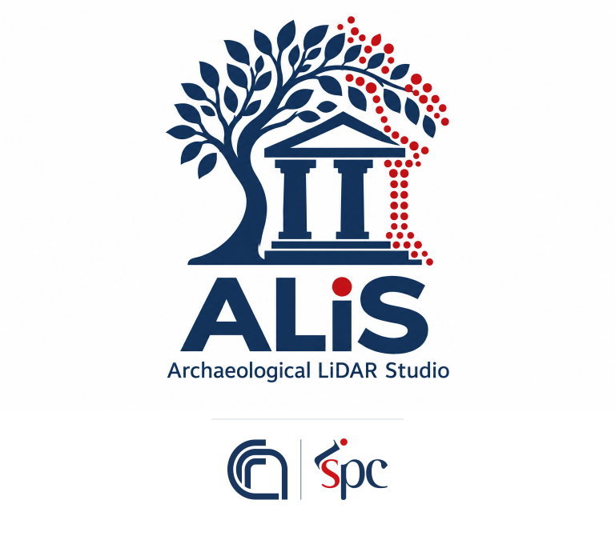
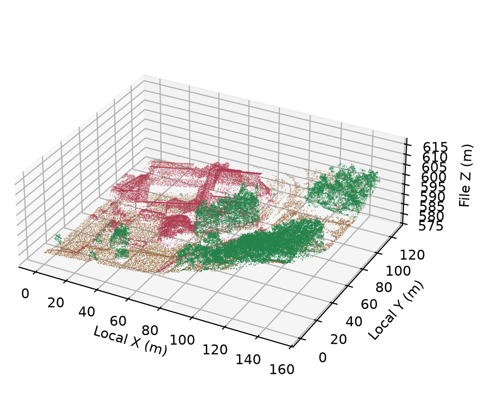
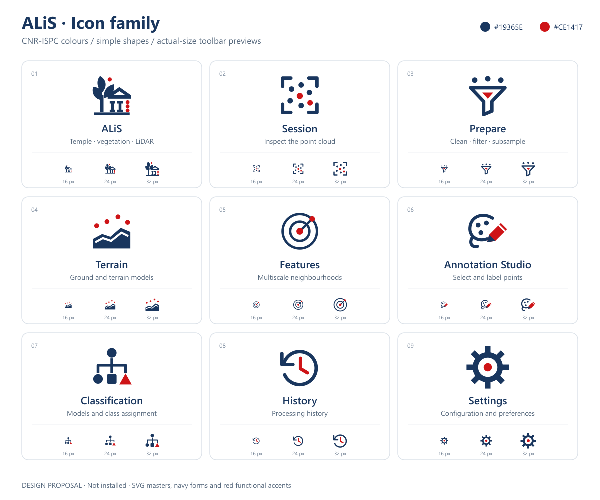
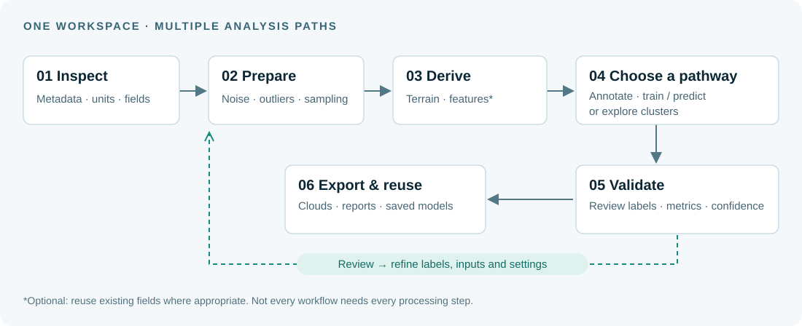
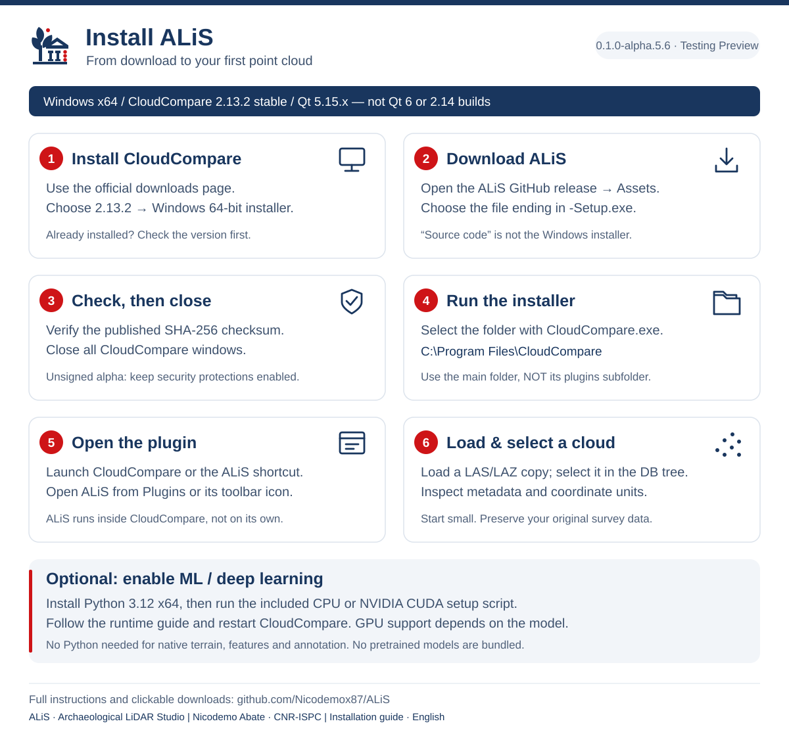

  

  <strong>A CloudCompare plugin for archaeological point-cloud analysis.</strong> 
  Prepare data. Explore geometry. Annotate, classify and validate.

  
  
  
  
  

  <a href="https://github.com/Nicodemox87/ALiS/releases/download/v0.1.0-alpha.5.6/ALiS-0.1.0-alpha.5.6-CloudCompare-2.13.2-Windows-x64-Setup.exe"><strong>Download Windows installer</strong></a> ·
  <a href="#getting-started">Getting started</a> ·
  <a href="#capabilities">Capabilities</a> ·
  <a href="#workflow">Workflow</a> ·
  <a href="https://github.com/Nicodemox87/ALiS/releases">Releases</a> ·
  <a href="https://doi.org/10.5281/zenodo.22934837">Zenodo DOI</a> ·
  <a href="https://github.com/Nicodemox87/ALiS/issues">Report an issue</a>

---

## Why ALiS?

**New to ALiS? [Follow the illustrated installation guide](docs/INSTALLATION.md)** — Windows requirements, downloads, setup and your first cloud.

Archaeological LiDAR interpretation is not just a classification problem. It requires checking the data, separating terrain from vegetation and structures, choosing meaningful spatial scales, and reviewing uncertain results.

**ALiS brings these steps into a connected CloudCompare workflow**, combining geometric analysis, expert annotation and reusable classification models. Its purpose is to support interpretation and reproducible analysis—not to replace archaeological judgement.

> **Public testing version: 0.1.0-alpha.5.6.** Source, installer and manual-install package are available below. This is a research alpha, not a production-certified release.
>
> **Research alpha:** outputs require operator review. Performance on one survey does not establish accuracy on a different site, sensor or acquisition configuration.

  

<strong>Piazza Armerina, Sicily.</strong> Display-sampled view of the manually labelled reference cloud: ground (brown), vegetation (green), buildings (red). This is a dataset illustration, not an automatic-classification result or an application screenshot.

## Capabilities

  

| Workspace | What you can do |
| :--- | :--- |
| **Session & display** | Inspect cloud statistics and available metadata; display RGB or scalar fields; adjust palettes and ranges. Cached statistics avoid unnecessary recalculation. |
| **Preparation** | Access CloudCompare outlier, noise and subsampling tools; retain control over the data used downstream. |
| **Terrain** | Apply cloth simulation filtering (CSF) or progressive morphological filtering; review ground labels; derive a DTM and height above ground where supported. |
| **Multiscale features** | Compute geometric descriptors and neighbourhood statistics at selected scales; inspect the resulting scalar fields. |
| **Annotation Studio** | Work with simultaneous views and movable metric sections; select points with rectangle, polygon, lasso and similarity tools; assign and review labels. |
| **Classification** | Train, compare and reuse supervised models; cluster existing RGB/scalar-field inputs; explore vegetation–structure separation with manual review. |
| **Validation & reuse** | Inspect metrics, confusion matrices and confidence; export reports; retain models and their metadata in a local catalogue. |

## Workflow

  

**Choose only the steps your task needs.** Existing scalar fields can be used for clustering without recomputing features. Manual review is part of the process: a vegetation–structure proposal is not a verified archaeological interpretation.

## Classification, with the differences made explicit

| Approach | Available methods in this alpha | Intended use |
| :--- | :--- | :--- |
| **Supervised machine learning** | Random Forest, Extra Trees, Histogram Gradient Boosting, XGBoost | Learn from labelled examples, assess held-out performance and reuse compatible saved models. |
| **Neural classification** | Descriptor-based MLP; experimental PointNet-style local XYZ network | Compare learned nonlinear or local spatial representations with descriptor-based models. |
| **Unsupervised clustering** | MiniBatch K-Means, BIRCH, Gaussian Mixture | Explore groups in selected inputs. Cluster IDs are not automatically semantic or ASPRS classes. |
| **Vegetation / structures** | Adaptive geometric proposals and feature-range review | Assist separation after ground extraction, retaining uncertain points for validation. Remaining points are not automatically buildings. |

<strong>Deep learning and GPU: what is—and is not—included</strong>

The PointNet-style classifier operates on local XYZ neighbourhoods. It is **not canonical PointNet with T-Nets, PointNet++, or a bundled pretrained foundation model**. No external pretrained weights are supplied.

Supervised CUDA paths are available for XGBoost, MLP and the local PointNet-style model when their dependencies, driver and GPU are compatible. Other operations remain CPU-based; PointNet neighbourhood lookup also uses the CPU. GPU acceleration is not a blanket guarantee of faster processing.

<strong>Validation and responsible interpretation</strong>

- Keep training and test data separate; favour spatially separated evaluation or an independent labelled cloud over testing on training points.
- Inspect per-class metrics and confusion matrices, not only overall accuracy.
- Model confidence is not necessarily a calibrated probability of correctness.
- Density, sampling geometry, occlusion, return metadata and feature scales affect model transfer.
- Review ground labels before terrain modelling, particularly below vegetation and near structures.
- Generalisation to independent archaeological sites remains an evaluation objective, not an established guarantee.
- Load only trusted model files: some serialisation formats can execute code.

## Getting started

**[Full step-by-step installation guide →](docs/INSTALLATION.md)** · [Download the infographic (PNG)](docs/media/install-guide.png)

### Download 0.1.0-alpha.5.6

**[Download Windows installer](https://github.com/Nicodemox87/ALiS/releases/download/v0.1.0-alpha.5.6/ALiS-0.1.0-alpha.5.6-CloudCompare-2.13.2-Windows-x64-Setup.exe)** · [Manual-install ZIP](https://github.com/Nicodemox87/ALiS/releases/download/v0.1.0-alpha.5.6/ALiS-0.1.0-alpha.5.6-CloudCompare-2.13.2-Windows-x64.zip) · [Source ZIP](https://github.com/Nicodemox87/ALiS/releases/download/v0.1.0-alpha.5.6/ALiS-0.1.0-alpha.5.6-Source.zip)

[SHA-256 checksums](downloads/CHECKSUMS_SHA256.txt) · [Release notes](RELEASE_NOTES.md) · [Installation & first test](docs/GETTING_STARTED.txt) · [Python / GPU setup](docs/RUNTIME.md) · [Build from source](BUILDING.md)

[Versioned GitHub prerelease](https://github.com/Nicodemox87/ALiS/releases/tag/v0.1.0-alpha.5.6) · [Package validation](docs/RELEASE_VALIDATION.md). Repository-hosted backup downloads are available in [downloads](downloads).

The installer is **unsigned**. Verify its origin and checksum; do not disable security protections. Packages contain no training data, pretrained weights or unpublished paper. Windows installer and ZIP contain the same native DLL and worker; choose one installation route.

| Component | Current development target |
| :--- | :--- |
| Operating system | Windows x64 |
| Host application | CloudCompare **2.13.2 stable**, **Qt 5.15.x** |
| Native operations | Terrain, features and annotation do not require Python |
| ML / DL operations | Separate Python runtime; optional XGBoost and PyTorch dependencies |
| GPU | Optional; supported methods and compatible CUDA hardware/runtime only |

The plugin is **not a standalone CloudCompare application** and is not compatible with arbitrary CloudCompare or Qt 6 builds. CloudCompare, Python, CUDA, training clouds and trained models are not bundled with the plugin installer.

Installation:

1. **Install CloudCompare 2.13.2 x64** from the [official downloads page](https://www.cloudcompare.org/release/) — choose the **2.13.2 Windows installer**, not the beta or ccViewer.
2. **Download ALiS `...-Setup.exe`** from the release's **Assets** section. “Source code” is for developers, not installation.
3. **Check its SHA-256**, then close all CloudCompare windows.
4. **Run Setup.exe** and select the folder containing `CloudCompare.exe`, usually `C:\Program Files\CloudCompare` — **not** its `plugins` subfolder.
5. **Open CloudCompare**, then ALiS from **Plugins** or its toolbar icon.
6. **Load a LAS/LAZ copy and select it in the DB tree.** Inspect metadata and coordinate units before processing.

For classifiers, install the separate runtime using the included CPU or CUDA setup script. **Python is not required for native terrain/features/annotation.** See [detailed steps and troubleshooting](docs/GETTING_STARTED.txt). To uninstall, select ALiS in Windows Installed Apps; user data and Python environments are retained.

Source code lives in [plugin](plugin); presets in [profiles](profiles). See [third-party notices](THIRD_PARTY_NOTICES.md), [contributing](CONTRIBUTING.md) and [security guidance](SECURITY.md). Published release assets are immutable; later revisions will use new version tags.

## Roadmap

Work in progress—not a list of shipped capabilities:

- Create a macOS version.
- Broader validation across archaeological sites and acquisition conditions.
- Improved tutorials, worked examples and documented reproducibility checks.
- Validated adapters for external pretrained models.
- Community-contributed datasets and model sharing with provenance, compatible labels and quality review.
- Create a stand-alone version for Windows and macOS.
- Implement LLM models to manage the workflow.

## Feedback & collaboration

Use [GitHub Issues](https://github.com/Nicodemox87/ALiS/issues) for bugs, ideas and feature requests. Include the ALiS version, CloudCompare version, operating system, processing steps and relevant logs. Remove personal paths and sensitive information before sharing files.

**Contact:** [nicodemo.abate@cnr.it](mailto:nicodemo.abate@cnr.it)

## Author & affiliation

**Created by Dr Nicodemo Abate**  
Tecnologo — CNR-ISPC, Sede Secondaria di Milano  
Consiglio Nazionale delle Ricerche — Istituto di Scienze del Patrimonio Culturale

The affiliation identifies the author's institution; it does not imply institutional certification of the software or its outputs.

## Citation

**Zenodo DOI supplied by the author:** [10.5281/zenodo.22934837](https://doi.org/10.5281/zenodo.22934837).

When describing your workflow, identify **ALiS — Archaeological LiDAR Studio**, Nicodemo Abate, the software version used and this repository URL. Basic software attribution is provided in [CITATION.cff](CITATION.cff); use the published Zenodo record for the final deposit citation once accessible. Associated scientific publications will be linked when available.

## Licence

**Software:** GNU General Public License, version 2 or later (**GPL-2.0-or-later**). See [LICENSE](LICENSE). Third-party components retain their respective licences.

**Original documentation:** unless otherwise indicated, [Creative Commons Attribution 4.0 International (CC BY 4.0)](https://creativecommons.org/licenses/by/4.0/). Institutional logos and third-party materials are excluded and remain subject to their respective rights. See [media notes](docs/media/README.md).

Research-alpha status describes maturity; it does not add a non-commercial or research-only restriction to the software licence.
